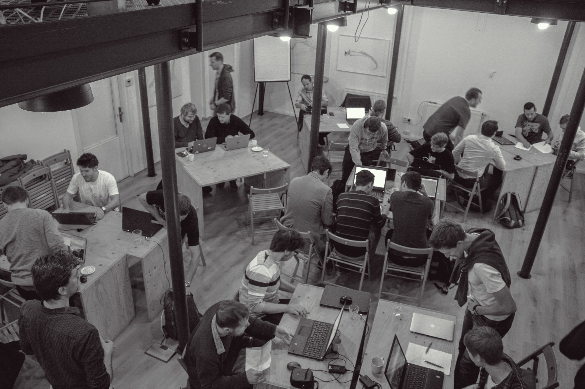

Určitě to znáte. Makáte, protože se blíží deadline, šéf je nervózní, nedokončená práce blokuje platbu od zákazníka… A jakmile dokončíte práci, přistane vám na stole nová. Pro práci samotnou nejste schopni si udělat čas na to, abyste se v něčem posunuli, zlepšili nebo se naučili na věc dívat z jiného úhlu. Nemáte čas naučit se nové dovednosti, které by vám mohli v práci pomoci.

Přesně z těchto důvodů vznikla v roce 2009 akce Coderetreat (nebo Code Retreat, pořád nevím jestli zvlášť nebo dohromady). Myšlenka je jednoduchá. Celý den procvičovat programátorské dovednosti.

Nezáleží na programovacím jazyku nebo IDE, které používáte. Coderetreat je místo, kde se v jeden den potkají programátoři, aby si vyměnili zkušenosti a něco se vzájemně naučili. Začátečníci tu získají od zkušenějších rady a tipy, které jim mohou zjednodušit nebo urychlit každodenní práci. Zkušenější zase na oplátku získají nové postřehy a podněty pro další zdokonalování. Ne nadarmo se říká, že chceš-li něco umět dobře, zkus to někoho naučit.

## Stojí to za to?

Mně osobně první Coderetreat doslova změnil život. Najednou jsem měl úplně nový pohled na to, že věci jdou dělat jinak a kvalitněji. Že testování není jenom pro testery a TDD nemusí být sprosté slovo a bláznivý výmysl těch co na to mají čas. Naučil jsem se několik nových fíglů pro ovládání IDE a výrazně si tak zjednodušil práci. Poznal nové lidí, kteří mají chuť se neustále zlepšovat a hledají cesty jak se posunout ještě kousíček dál. A hlavně jsem si odnesl takové množství chuti a energie do programování jako nikdy předtím.

## O co vlastně půjde?

Celá akce má několik základních pravidel:

  - Celý den je rozdělen (většinou) do šesti programovacích session. Jedna session má 45 minut.
  - V každé z nich se řeší se stále stejná, jednoduchá úloha: [Game of Life](http://cs.wikipedia.org/wiki/Hra_%C5%BEivota).
  - Důraz je kladen na čistotu kódu, [TDD](http://en.wikipedia.org/wiki/Test-driven_development) a [pravidla jednoduchého návrhu](http://www.thinkcode.se/blog/2011/04/06/four-rules-of-simple-design).
  - Programuje se v [párech](http://cs.wikipedia.org/wiki/Extr%C3%A9mn%C3%AD_programov%C3%A1n%C3%AD#P.C3.A1rov.C3.A9_programov.C3.A1n.C3.AD). Pro každou session máte jiného partnera.
  - Po každé session smažete vytvořený kód.
  - Pro pestrost je každá session omezena několika podmínkami.

Stará buddhistická pravda tvrdí, že samotná cesta je nejlepší cíl. O Coderetreat to platí stoprocentně. Jakmile se totiž odpoutáte od nutnosti dokončit zadání (většinou hned po první session) máte najednou tolik možností jak problém uchopit, pohrát si s ním a něčemu novému se naučit. K tomu vás většinou tlačí omezující podmínky jako třeba zákaz používání myši (umíte ovládat své IDE?), povolení maximálně 4 řádků na metodu a podobné.

Na konci každé session probíhá retrospektiva, kdy se probírá uplynulá session, jaké byly největší problémy nebo co nás nejvíc bavilo. Na konci celého dne je jedna velká retrospektiva, kde účastníci hodnotí průběh akce.

Pro podrobnější popis, jak celá akce probíhala loni ve Vsetíně, včetně záznamu retrospektivy, můžete nahlédnout na [článek v blogu od Roberta Dreslera](http://www.robertdresler.cz/2014/01/fenomen-coderetreat.html).

## Chci přijít, co s sebou?

Pokud to chcete zažít, přijďte letos na Global day of Coderetreat. **V sobotu 15. listopadu** se bude konat po celém světě. Momentálně na 121 místech a Česká Republika nebude výjimkou. Zatím jsou ohlášeny tři akce:

  - Čechy a okolí pokryje [Praha](http://srazy.info/coderetreat/4713),
  - programátoři z Moravy a Slezska se sejdou ve [Vsetíně](http://srazy.info/coderetreat/4822),
  - a zkrátka nepřijdou ani programátoři [v Brně](http://srazy.info/coderetreat/4899)

Víc se o akci můžete dozvědět na oficiálních stránkách [Global Day of Coderetreat](http://gdcr.coderetreat.org/) nebo na české stránce [Coderetreat.cz](http://coderetreat.cz/).

S sebou si určitě nezapomeňte vzít svůj stroj (notebook nebo klidně i All-in-one PC) a na něm mějte nainstalované prostředí pro testování. Určitě je dobré zkusit si napsat a spustit první test ještě doma, ale pokud nestíháte nic se neděje. Na akci většinou slouží první session právě k tomu aby jste si mohli všechno rozchodit. Většina testovacích frameworků má ve svém názvu _xUnit_.

  - Java – [jUnit](http://junit.org/)
  - C# – [NUnit](http://www.nunit.org/) nebo od Visual Studia 2012 po novější najdete MsUnit
  - PHP – nečekaně [PHPUnit](https://phpunit.de/) :)

Pro rozchození zkuste prozkoumat temné vody internetu, určitě najdete pro váš jazyk vhodný návod.

Zkusit si jednou Coderetreat by měl každý programátor, který to s programováním myslí vážně. A co vy? Chcete se zlepšit ve svém řemesle? Posunout dál? Poznat nové cesty a možnosti? Pokud ano, tak se na vás těšíme 15. listopadu. Třeba i vám změní Coderetreat život.

> Utekl vám Coderetreat před nosem? 
> Přidejte se do Meetupu [Coderetreat CZ](https://www.meetup.com/CodeRetreat-CZ/), kde oznamujeme všechny veřejně vypsané Coderetreaty v ČR
