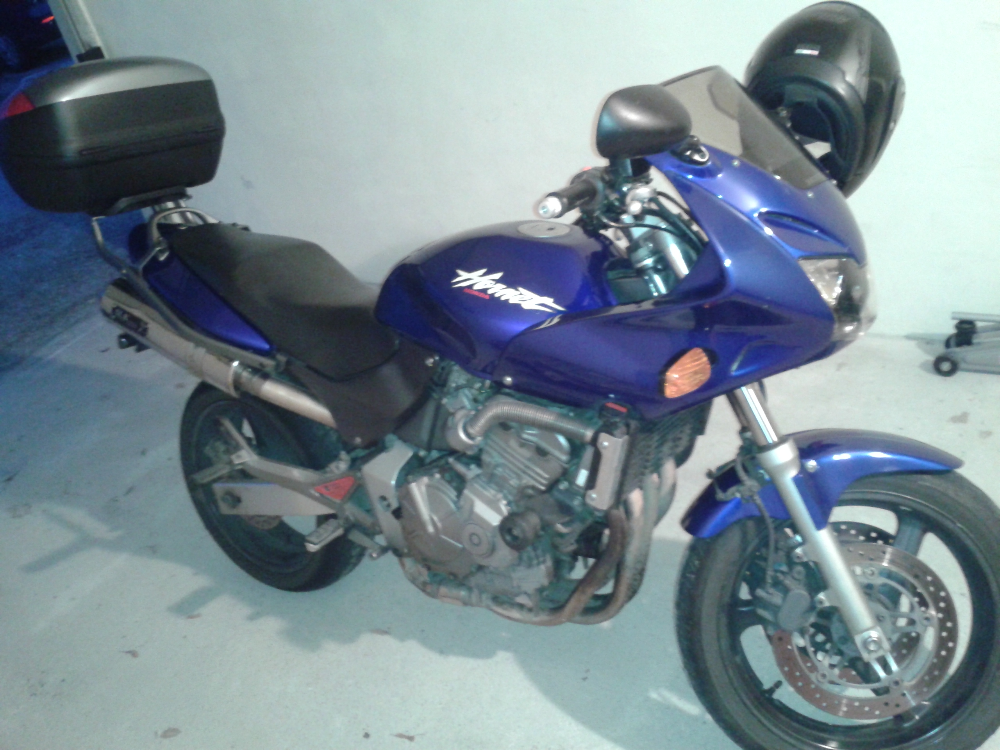
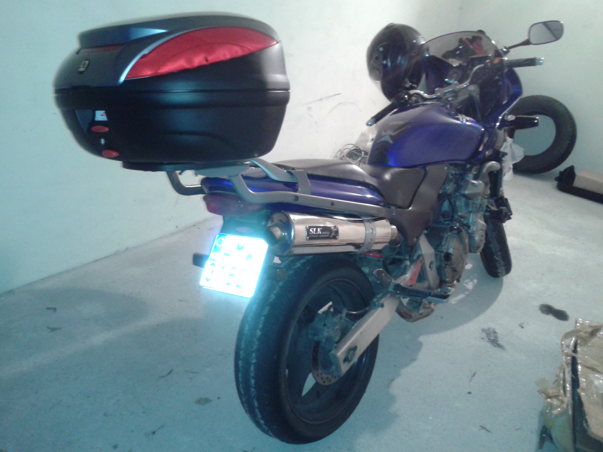

Už dlouho jsem si chtěl na motorku pořídit kufry. Ono jezdit s věcma v tankvaku a batohu taky jde, ale přeci jenom to není tak pohodlné a kapacitně to ne vždy stačí. A když měli v prostějovském Freemoto akci kufr + plotna za 2600,- tak kdy do toho jít, než teď.

Nejdřív jsem jel do Freemota, abych se podíval jak ten kufr vlastně vypadá a co všechno budu potřebovat. Ukázalo se, že ke kufru je „univerzální“ plotna, takže by to mělo jít namontovat na cokoliv. OK, paráda. Objednáme z nějakého eshopu držáky a budeme mít kufr.

Volba nakonec padla na web miramoto.cz. Mají všechno skladem a výběr víc než velký. První dilema přišlo velmi rychle. Vzít nosič jenom na zadní kufr nebo na boční a zadní zároveň. Časem bych chtěl pořídit i boční, kvůli plánovaným delším výletům. Nakonec jsem se rozhodl jenom pro horní nosič. Na boční kufry stejně nemám zatím rozpočet, takže budeme jezdit s jedním a uvidíme. Objednal jsem nakonec nosič, tašku do kufru, nějakou kosmetiku a čekal na dodání. Hned další den přijel velký balík se vším pohromadě. Všechno pečlivě zabalené. V sobotu jsem jel do Freemota pro kufry a hurá do garáže všechno přimontovat.

Nejvíc jsem byl zvědavý na nosič zadního kufru. Ten byl zatavený do hrubé fólie a přišla první zrada – nemám u sebe ani v garáži nůž. Takže jsem postupně šroubovákem fólii proděravěl a po chvilkovém boji se mi nosič rozbalit. Vypadlo na mě šest podivně tvarovaných kovových součástek. Z toho jsem poznal tak akorát to, že ta nejdelší přijde na bok motorky, ale jak se tam zahákne to jsem netušil. Podle přiloženého návodu jsem se nakonec dopátral kam co přijde, i když to chtělo trochu představivosti.

Spodní díly, které jdou pod sedlo, šli přichytit bez problémů. Horní bylo potřeba přimontovat na madlo. Přišel druhý problém – jak se dostává to madlo dolů. Zhora je hladká hlava a z podsedlové strany jsem nenahmatal žádné matky a i kdyby, tak není moc místa jak je uvolnit. Přece nemůžou být takoví blbci a k tomu madlu se musí dát nějak rozumně dostat. Nakonec jsem objevil tu fintu objevil. Horní hladká hlava šroubů je jenom krytka a pod ní se na smály imbusové hlavičky. Pak už bylo všechno jenom otázkou času a šroubování.

Třetí zrada přišla ve chvíli, kdy jsem se chystal nainstalovat univerzální plotnu na kufr. Ona univerzální plotna byla totiž malá. Nakonec se mi ji podařilo přesvědčit alespoň na dva ze čtyř šroubků. Drží sice pevně, ale přeci jenom objednám asi originál GIVI.

Slavnostní nasazení kufru na plotnu už bylo otázkou několika okamžiků. Mírné zklamání přišlo ve chvíli, kdy jsem zkusil do kufru uložit obě helmy. Ony se tam totiž nevlezou. Respektive vlezou, ale kufr pak nejde zavřít. Moje NOLAN helma je o kousek větší než integrální Lazer. Ach jo, ale co se dá dělat, alespoň jednu tam pro spolujezdce převezu vždycky a druhou budu mít na hlavě :)

S kufrem jsem se zkusmo projel a ani jsem nevěděl, že ho mám za sebou. Chvilku jsem byl nervózní, protože jsem ho ani ve zpětném zrcátku neviděl, ale držel pevně. Takže můžu bez obav začít plánovat delší výlety a víkendové akce na motorce. Jupí :)
